# 🏗️ EduCert Smart Contract System Architecture Flowchart

## 📋 System Overview
This flowchart shows how all EduCert smart contracts are interconnected and how external services (Alchemy, Bundlers, LayerZero) integrate with the system.

---

## 🔄 Complete System Flowchart

```mermaid
graph TB
    %% External Services
    subgraph "🌐 External Services"
        ALCH[Alchemy Account Kit<br/>Gas Sponsorship]
        BUNDLER[ERC-4337 Bundlers<br/>UserOperation Processing]
        LZ[LayerZero<br/>Cross-Chain Bridge]
        ETH[Ethereum/Polygon<br/>Blockchain Networks]
    end

    %% Core System Foundation
    subgraph "🏛️ Core System Foundation"
        VL[VerificationLogger<br/>📝 Central Event Logging]
        CR[ContractRegistry<br/>📋 Contract Address Registry]
        ST[SystemToken<br/>🪙 Native Token]
    end

    %% Identity & Trust Layer
    subgraph "🆔 Identity & Trust Layer"
        UIR[UserIdentityRegistry<br/>👤 User Identity Management]
        TS[TrustScore<br/>⭐ Trust Score Calculation]
        
        %% Verification Managers
        FVM[FaceVerificationManager<br/>📸 Face Verification]
        AVM[AadhaarVerificationManager<br/>🆔 Aadhaar Verification]
        IVM[IncomeVerificationManager<br/>💰 Income Verification]
        OVM[OfflineVerificationManager<br/>📄 Offline Verification]
    end

    %% Organization Layer
    subgraph "🏢 Organization Layer"
        OR[OrganizationRegistry<br/>🏛️ Organization Management]
        CM[CertificateManager<br/>📜 Certificate Issuance]
        RM[RecognitionManager<br/>🏆 Badge & Recognition]
    end

    %% Account Abstraction Layer
    subgraph "🔐 Account Abstraction Layer"
        EP[EduCertEntryPoint<br/>🚪 ERC-4337 Entry Point]
        ECF[EduCertAccountFactory<br/>🏭 Account Creation Factory]
        EMA[EduCertModularAccount<br/>🔑 Smart Account Implementation]
        AGM[AlchemyGasManager<br/>⛽ Gas Sponsorship Manager]
    end

    %% Advanced Features
    subgraph "⚡ Advanced Features"
        GM[GuardianManager<br/>🛡️ Account Recovery]
        AWM[AAWalletManager<br/>💼 Wallet Management]
        PM[PaymasterManager<br/>💳 Payment Processing]
        MM[MigrationManager<br/>🔄 Account Migration]
        EI[EconomicIncentives<br/>💎 Reward System]
    end

    %% Governance Layer
    subgraph "🏛️ Governance Layer"
        GOV[GovernanceManager<br/>🗳️ Governance System]
        DR[DisputeResolution<br/>⚖️ Dispute Handling]
    end

    %% Privacy & Cross-Chain
    subgraph "🔒 Privacy & Cross-Chain"
        PRIV[PrivacyManager<br/>🔐 Privacy Controls]
        CCM[CrossChainManager<br/>🌉 Cross-Chain Operations]
        GCA[GlobalCredentialAnchor<br/>🌍 Global Credential Hub]
    end

    %% External Service Connections
    ALCH --> AGM
    BUNDLER --> EP
    LZ --> CCM
    ETH --> VL

    %% Core Foundation Dependencies
    VL --> TS
    VL --> UIR
    VL --> CR
    VL --> ST

    %% Identity & Trust Dependencies
    UIR --> FVM
    UIR --> AVM
    UIR --> IVM
    UIR --> OVM
    TS --> VL
    FVM --> VL
    AVM --> VL
    IVM --> VL
    OVM --> VL

    %% Organization Dependencies
    CM --> OR
    CM --> VL
    CM --> TS
    RM --> VL
    RM --> TS
    OR --> VL

    %% Account Abstraction Dependencies
    EP --> VL
    EP --> TS
    ECF --> EP
    ECF --> EMA
    ECF --> AGM
    ECF --> VL
    ECF --> TS
    EMA --> EP
    EMA --> VL
    AGM --> TS
    AGM --> VL
    AGM --> ALCH

    %% Advanced Features Dependencies
    GM --> VL
    GM --> TS
    AWM --> VL
    AWM --> TS
    PM --> VL
    PM --> TS
    MM --> VL
    MM --> TS
    EI --> VL
    EI --> TS

    %% Governance Dependencies
    GOV --> VL
    GOV --> TS
    DR --> VL
    DR --> TS

    %% Privacy & Cross-Chain Dependencies
    PRIV --> VL
    PRIV --> TS
    CCM --> VL
    CCM --> TS
    CCM --> LZ
    GCA --> VL
    GCA --> TS
    GCA --> CCM

    %% Styling
    classDef external fill:#e1f5fe,stroke:#01579b,stroke-width:2px
    classDef core fill:#f3e5f5,stroke:#4a148c,stroke-width:2px
    classDef identity fill:#e8f5e8,stroke:#1b5e20,stroke-width:2px
    classDef organization fill:#fff3e0,stroke:#e65100,stroke-width:2px
    classDef account fill:#fce4ec,stroke:#880e4f,stroke-width:2px
    classDef advanced fill:#f1f8e9,stroke:#33691e,stroke-width:2px
    classDef governance fill:#e3f2fd,stroke:#0d47a1,stroke-width:2px
    classDef privacy fill:#f9fbe7,stroke:#827717,stroke-width:2px

    class ALCH,BUNDLER,LZ,ETH external
    class VL,CR,ST core
    class UIR,TS,FVM,AVM,IVM,OVM identity
    class OR,CM,RM organization
    class EP,ECF,EMA,AGM account
    class GM,AWM,PM,MM,EI advanced
    class GOV,DR governance
    class PRIV,CCM,GCA privacy
```



---

## 🔗 Key Integration Points

### 1. **Alchemy Integration** 🔵
- **AlchemyGasManager** connects to Alchemy's Account Kit
- Provides gasless transactions for users based on trust scores
- Supports onboarding gas allowance (2M gas for 7 days)
- Tiered gas limits: High Trust (1M), Medium (500k), Low (250k), Basic (100k)

### 2. **ERC-4337 Bundler Integration** 🟢
- **EduCertEntryPoint** wraps standard ERC-4337 EntryPoint
- **EduCertModularAccount** implements smart account functionality
- **EduCertAccountFactory** creates accounts with session keys
- Bundlers process UserOperations through the EntryPoint

### 3. **LayerZero Cross-Chain Integration** 🟡
- **CrossChainManager** handles cross-chain operations
- **GlobalCredentialAnchor** maintains global credential state
- Syncs certificates, trust scores, and identity data across chains

---

## 📊 Data Flow Architecture

### **User Registration Flow**
```
User → UserIdentityRegistry → VerificationLogger
     ↓
TrustScore (Initialize) → VerificationLogger
     ↓
Face/Aadhaar/Income Verification → TrustScore Update
     ↓
Certificate Issuance → Organization Registry
```

### **Account Creation Flow**
```
User → EduCertAccountFactory → EduCertModularAccount
     ↓
AlchemyGasManager (Check Eligibility) → TrustScore
     ↓
Session Keys Creation → Privacy Manager
     ↓
Account Ready for dApp Interactions
```

### **Transaction Flow**
```
User → EduCertModularAccount → EduCertEntryPoint
     ↓
Bundler → AlchemyGasManager (Gas Sponsorship)
     ↓
Execution → VerificationLogger (Event Logging)
     ↓
TrustScore Update → Cross-Chain Sync
```

---

## 🎯 Contract Categories & Responsibilities

### **Core Foundation** 🏛️
- **VerificationLogger**: Central event logging for all system activities
- **ContractRegistry**: Manages all contract addresses and versions
- **SystemToken**: Native token for the EduCert ecosystem

### **Identity & Trust** 🆔
- **UserIdentityRegistry**: Manages user identities and commitments
- **TrustScore**: Calculates and maintains user trust scores
- **Verification Managers**: Handle different verification methods

### **Organization Management** 🏢
- **OrganizationRegistry**: Manages educational institutions
- **CertificateManager**: Issues and manages certificates (ERC-721)
- **RecognitionManager**: Handles badges and recognition systems

### **Account Abstraction** 🔐
- **EduCertEntryPoint**: ERC-4337 entry point with trust score integration
- **EduCertAccountFactory**: Creates modular accounts with session keys
- **EduCertModularAccount**: Smart account with privacy features
- **AlchemyGasManager**: Gas sponsorship based on trust scores

### **Advanced Features** ⚡
- **GuardianManager**: Account recovery and security
- **AAWalletManager**: Wallet management and operations
- **PaymasterManager**: Payment processing and subscriptions
- **MigrationManager**: Account migration between implementations
- **EconomicIncentives**: Reward system for user participation

### **Governance** 🏛️
- **GovernanceManager**: Decentralized governance system
- **DisputeResolution**: Handles disputes and appeals

### **Privacy & Cross-Chain** 🔒
- **PrivacyManager**: Privacy controls and data protection
- **CrossChainManager**: Cross-chain operations via LayerZero
- **GlobalCredentialAnchor**: Global credential synchronization

---

## 🔄 External Service Integration Details

### **Alchemy Account Kit** 🔵
- **Gas Sponsorship**: Trust score-based gas limits
- **Account Creation**: Gasless account setup
- **Session Keys**: Privacy-preserving dApp interactions
- **Paymaster Integration**: Seamless payment processing

### **ERC-4337 Bundlers** 🟢
- **UserOperation Processing**: Standard ERC-4337 flow
- **Gas Estimation**: Dynamic gas calculation
- **Transaction Batching**: Multiple operations in one transaction
- **EntryPoint Integration**: Custom EduCert EntryPoint wrapper

### **LayerZero Cross-Chain** 🟡
- **Certificate Sync**: Cross-chain certificate verification
- **Trust Score Sync**: Unified trust scores across chains
- **Identity Sync**: Cross-chain identity management
- **Governance Sync**: Cross-chain governance decisions

---

## 🚀 Key Features & Benefits

### **For Users** 👥
- **Gasless Onboarding**: No gas fees for new users
- **Privacy by Default**: Different session keys per dApp
- **Cross-Chain**: Works across multiple networks
- **Recovery**: Guardian-based account recovery

### **For Organizations** 🏢
- **Certificate Management**: Easy certificate issuance
- **Trust Integration**: Trust score-based verification
- **Cross-Chain**: Global certificate recognition
- **Governance**: Decentralized decision making

### **For Developers** 👨‍💻
- **Alchemy Compatible**: Works with existing Alchemy infrastructure
- **ERC-4337 Standard**: Standard account abstraction
- **Session Keys**: Privacy-preserving dApp integration
- **Trust Scores**: Reputation-based features

---

## 📈 System Scalability & Performance

### **Gas Optimization**
- **Batch Operations**: Multiple operations in single transaction
- **Gas Sponsorship**: Trust score-based gas limits
- **Onboarding**: 2M gas allowance for new users
- **Tiered Limits**: Different limits based on trust levels

### **Cross-Chain Efficiency**
- **LayerZero Integration**: Efficient cross-chain messaging
- **Credential Anchoring**: Global credential synchronization
- **Trust Score Sync**: Unified reputation across chains
- **Certificate Verification**: Cross-chain certificate validation

### **Privacy & Security**
- **Session Keys**: dApp-specific private keys
- **Zero-Knowledge**: Privacy-preserving verification
- **Guardian System**: Account recovery mechanisms
- **Dispute Resolution**: Fair dispute handling

---

This architecture provides a comprehensive, scalable, and privacy-preserving system for educational credential management with seamless integration of external services like Alchemy, ERC-4337 bundlers, and LayerZero cross-chain infrastructure.
